<h1 align="center">
  <br>
  <a href="https://www.github.com/pushpendra1337/MeetEazy"></a>
  <br>
  MeetEazy
  <br>
</h1>

<h2 align="center">MeetEazy is an android app for creating and joining video conferencing, online meetings, virtual training classes and, group video calls.</h2>

<h2 align="center">
  <a href="#screenshots">Screenshots</a> •
  <a href="#features">Features</a> •
  <a href="#setup">Setup</a> •
  <a href="#download">Download</a> •
  <a href="#credits">Credits</a> •
  <a href="#contribution">Contribution</a> •
  <a href="#contact">Contact</a>
</h2>

<h4 align="center">Made with ❤️ in India</h4>

<p align="center">
    <a href="https://www.android.com" target="_blank">
        
    </a>
    <a href="https://firebase.google.com" target="_blank">
        
    </a>
    <a href="https://www.java.com" target="_blank">
        
    </a>
    <a href="https://jitsi.org/jitsi-meet/" target="_blank">
        
    </a>
    <a href="https://github.com/jitsi/jitsi-meet" target="_blank">
        
    </a>
    
    
</p>

# Screenshots

| 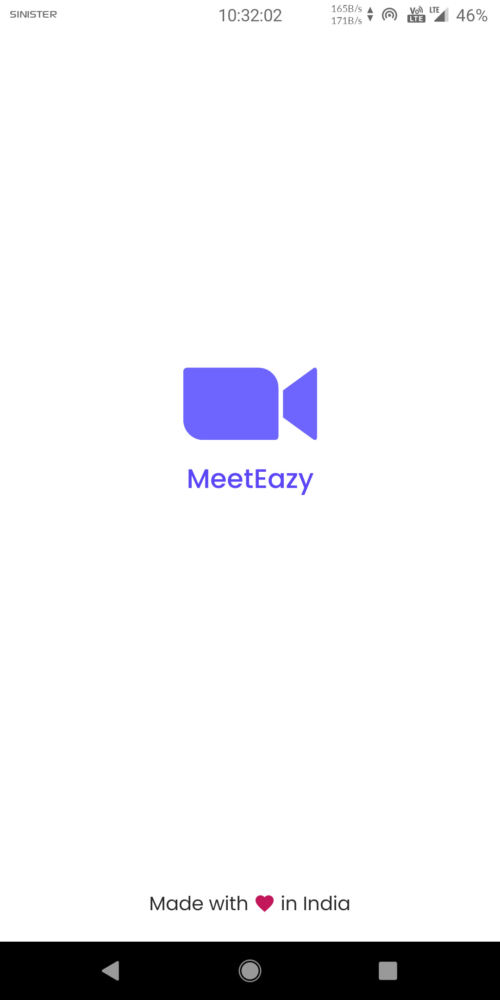 | 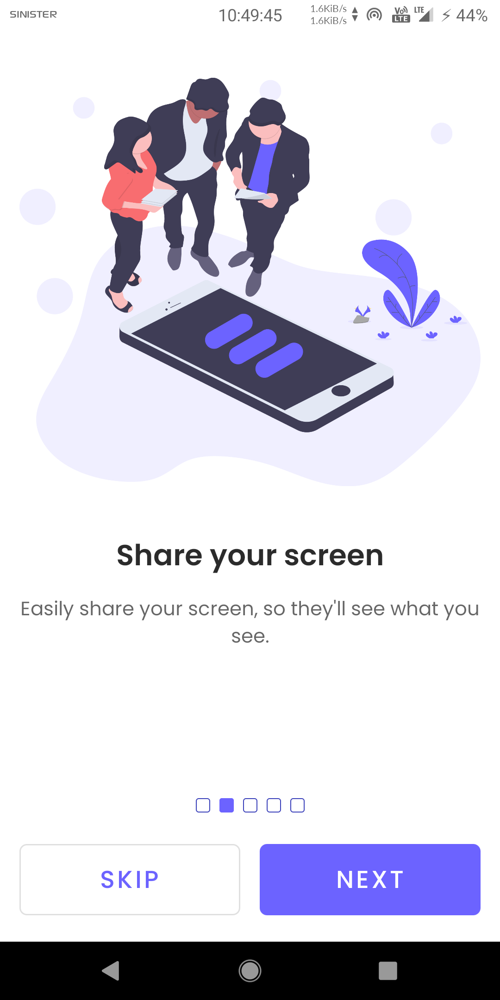 | 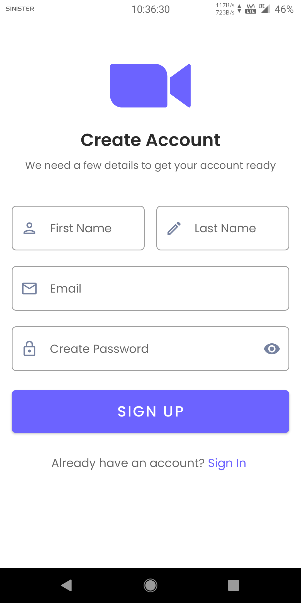 |
|:---:|:---:|:---:|
| Splash Screen | Onboarding Screen | Sign Up Screen |

| 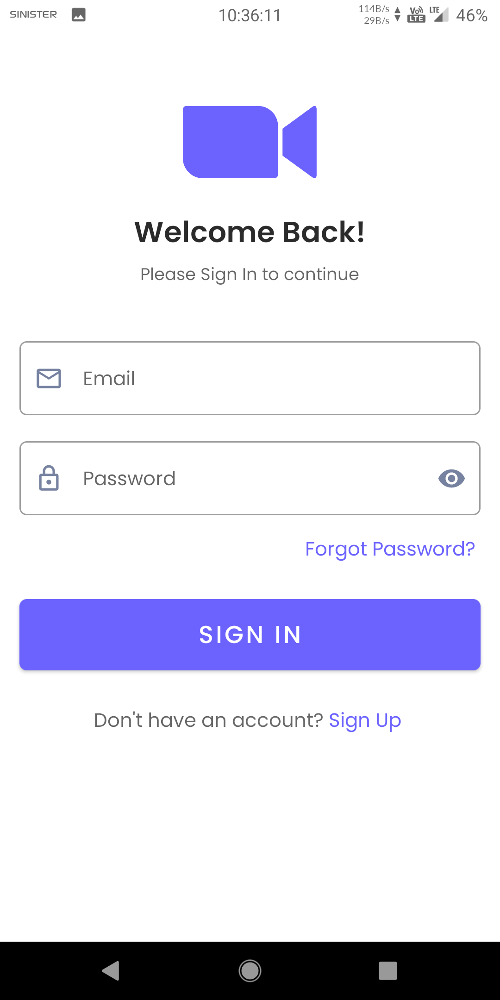 | 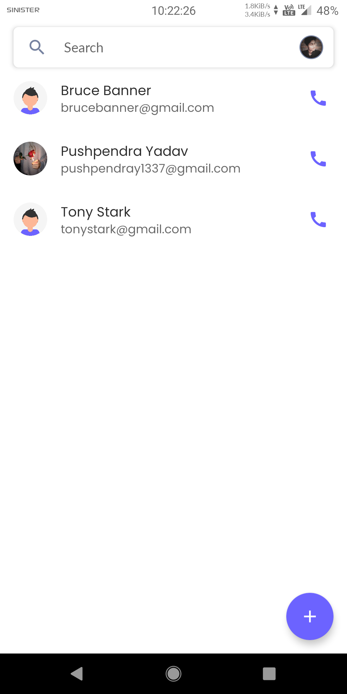 | 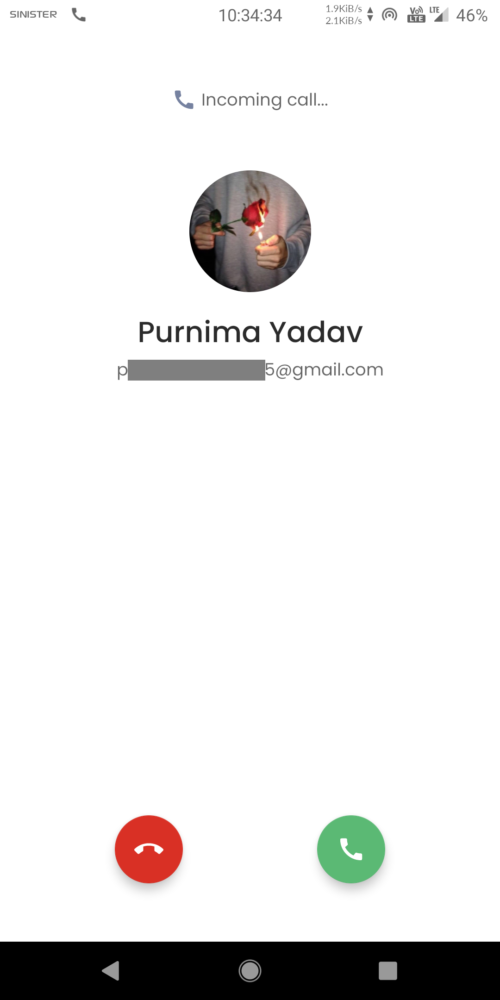 |
|:---:|:---:|:---:|
| Sign In Screen | Home Screen | Incoming Call Screen |

| 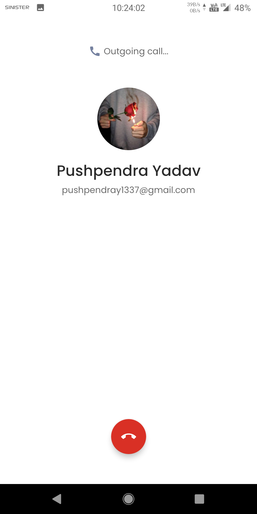 | 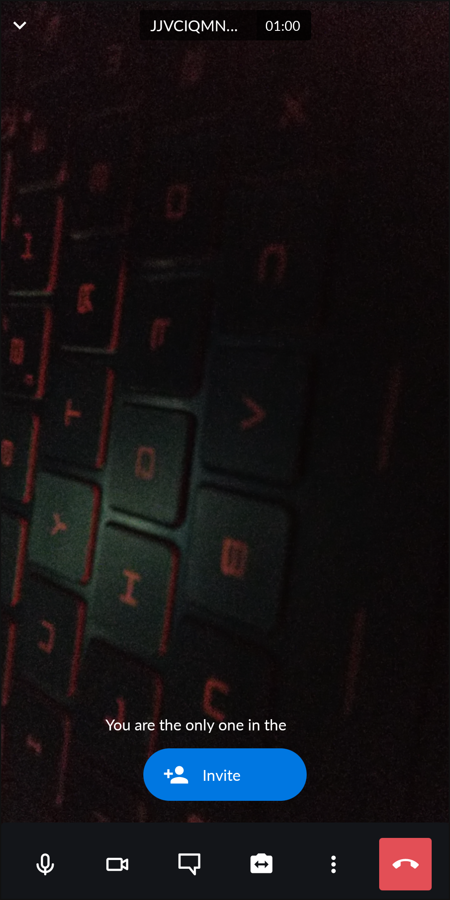 | 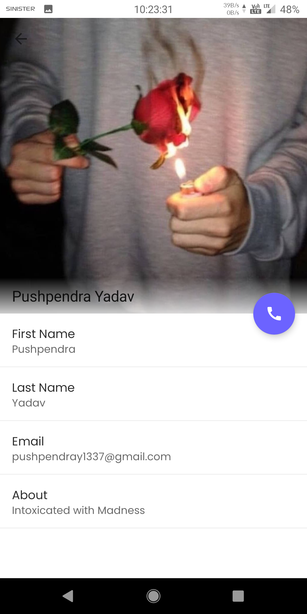 |
|:---:|:---:|:---:|
| Outgoing Call Screen | Ongoing Meeting Screen | View Profile Screen |

| 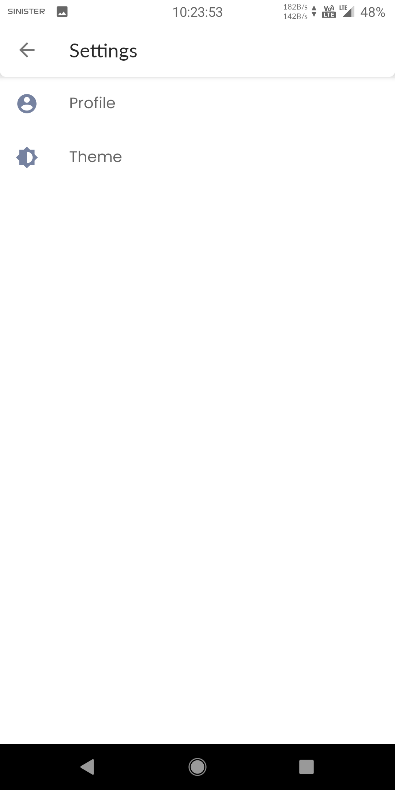 | 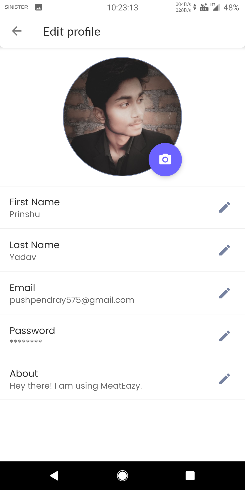 | 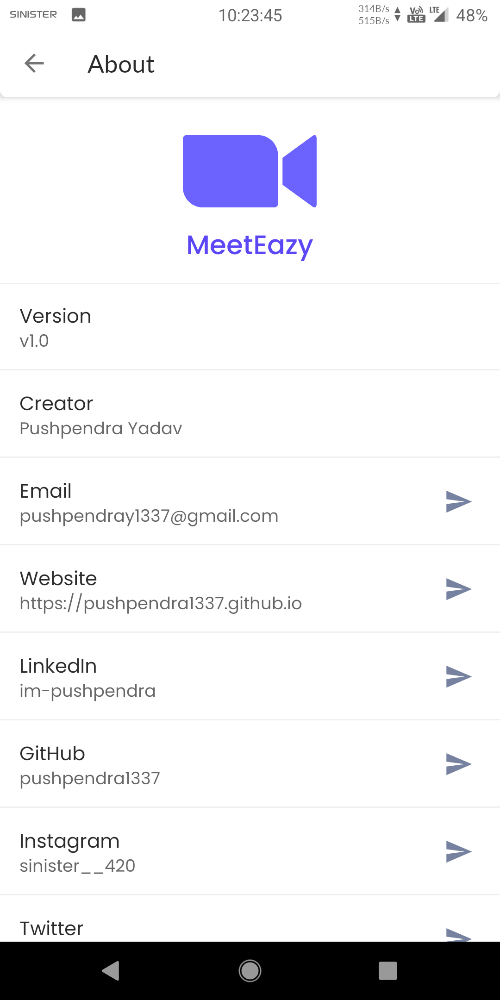 |
|:---:|:---:|:---:|
| Settings Screen  | Edit Profile Screen | About Screen |

# Features

* Create meeting room
* Join meeting room
* Personal and group meeting calls
* Screen Sharing
* Picture-in-picture mode
* Live chat feature
* Start recording
* Share video
* Start live stream
* Lobby mode
* Lock meeting room
* Add meeting password
* Kick-out participants
* Invite and add participants
* Raise hand
* Mute audio and video
* Create account
* Edit account
* Create contacts
* Delete contacts
* Search contacts
* Theming options

# Setup

## Getting Started

To get a local copy up and running follow these simple steps.

## Prerequisites

* Android Studio

## Installation

1. Clone the repo
   ```sh
   git clone https://www.github.com/pushpendra1337/MeetEazy.git
   ```
2. Create and setup a new Firebase project.

3. Go to your Project settings in the Firebase console.

4. Get the Firebase config file "`google-services.json`".

5. Put Firebase config file in the root of `app` directory.

6. Follow the steps given at [https://firebase.google.com/docs/cloud-messaging/android/client](https://firebase.google.com/docs/cloud-messaging/android/client) to get FCM API Key.

7. Paste your FCM API Key in `app\src\main\java\net\intensecorp\meeteazy\utils\ApiUtility.java`
   ```java
   private static final String AUTHORIZATION_KEY ="Your FCM API Key";
   ```
8. Build the Project.

9. Done

## Permissions Required

    `android.permission.ACCESS_NETWORK_STATE`
    `android.permission.INTERNET`
    `android.permission.CAMERA`
    `android.permission.VIBRATE`
    `android.permission.READ_EXTERNAL_STORAGE`
    `android.permission.WRITE_EXTERNAL_STORAGE`

# Download

You can download the latest installable version of MeetEazy for android from [here](https://github.com/pushpendra1337/MeetEazy/release/tag/v1.0).

# Credits

This software uses the following open source packages or libraries:

- [Jitsi Meet SDK](https://github.com/jitsi/jitsi-meet)
- [Retrofit](https://github.com/square/retrofit)
- [Glide](https://github.com/bumptech/glide)
- [Dexter](https://github.com/Karumi/Dexter)
- [uCrop](https://github.com/Yalantis/uCrop)
- [SimpleSearchView](https://github.com/Ferfalk/SimpleSearchView)
- [Butter Knife](https://github.com/JakeWharton/butterknife)
- [CircleImageView](https://github.com/hdodenhof/CircleImageView)
- [Material View Pager Dots Indicator](https://github.com/tommybuonomo/dotsindicator)

Special thanks to [undraw.co](https://undraw.co) for providing beautiful illustrations.

# Contribution

In any case, you find or notice any bugs please report them by sending me an [e-mail](mailto:pushpendray1337@gmail.com). I will fix bugs as soon as possible. If you have any feature suggestions, please create an issue with detailed information.

# Contact

**Email:** pushpendray1337@gmail.com  
**Website:** https://pushpendra1337.github.io  
**LinkedIn:** https://www.linkedin.com/in/im-pushpendra  
**Instagram:** https://instagram.com/sinister__420  
**Twitter:** https://twitter.com/sinister__420/
